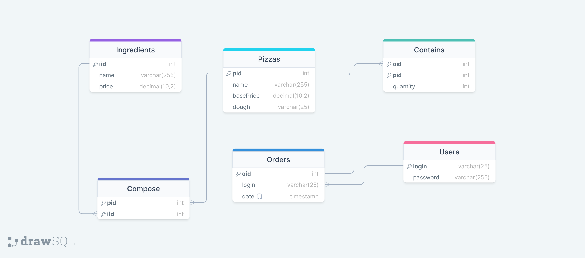

# API REST : Pizzeria

Par Selim Hamza et Anas Ouhdda (S4-K)

## Mise en place

1. Créer une base de données et importer le fichier [`pizzeria.sql`](pizzeria.sql)
2. Entrer les configurations de la base de données dans le fichier [`WEB-INF/config.prop`](config.prop)
3. Compiler les servlets en lançant le script [`compile.sh`](../compile.sh)
4. Démarrer le serveur Tomcat en lançant le script [`run.sh`](../run.sh)

## Rapport sur la structure des tables et les requêtes de l'API

### Tables de la base de données

#### Table `users`
- Stocke les informations des utilisateurs.
- Colonnes:
  - `login`: Chaîne de caractères (VARCHAR) de taille maximale 25, clé primaire, représente le nom d'utilisateur.
  - `password`: Chaîne de caractères (VARCHAR) de taille maximale 255, représente le mot de passe de l'utilisateur.

#### Table `ingredients`
- Contient les détails des ingrédients disponibles pour les pizzas.
- Colonnes:
  - `iid`: Clé primaire auto-incrémentée, représente l'identifiant de l'ingrédient.
  - `name`: Chaîne de caractères (VARCHAR) de taille maximale 255, représente le nom de l'ingrédient.
  - `price`: Nombre décimal (DECIMAL) de taille (10, 2), représente le prix de l'ingrédient.

#### Table `pizzas`
- Stocke les informations sur les pizzas disponibles.
- Colonnes:
  - `pid`: Clé primaire auto-incrémentée, représente l'identifiant de la pizza.
  - `name`: Chaîne de caractères (VARCHAR) de taille maximale 255, représente le nom de la pizza.
  - `basePrice`: Nombre décimal (DECIMAL) de taille (10, 2), représente le prix de base de la pizza.
  - `dough`: Chaîne de caractères (VARCHAR) de taille maximale 25, représente le type de pâte de la pizza (défaut: 'classic').

#### Table `compose`
- Une table de liaison entre les pizzas et les ingrédients, indiquant quels ingrédients composent chaque pizza.
- Colonnes:
  - `pid`: Clé étrangère faisant référence à `pizzas(pid)`, représente l'identifiant de la pizza.
  - `iid`: Clé étrangère faisant référence à `ingredients(iid)`, représente l'identifiant de l'ingrédient.

#### Table `orders`
- Stocke les informations sur les commandes passées par les utilisateurs.
- Colonnes:
  - `oid`: Clé primaire auto-incrémentée, représente l'identifiant de la commande.
  - `login`: Clé étrangère faisant référence à `users(login)`, représente le nom d'utilisateur qui a passé la commande.
  - `date`: Horodatage (TIMESTAMP), représente la date et l'heure de la commande.

#### Table `contains`
- Une table de liaison entre les commandes et les pizzas, indiquant quelles pizzas sont incluses dans chaque commande.
- Colonnes:
  - `oid`: Clé étrangère faisant référence à `orders(oid)`, représente l'identifiant de la commande.
  - `pid`: Clé étrangère faisant référence à `pizzas(pid)`, représente l'identifiant de la pizza.
  - `quantity`: Nombre entier (INT), représente la quantité de la pizza incluse dans la commande.